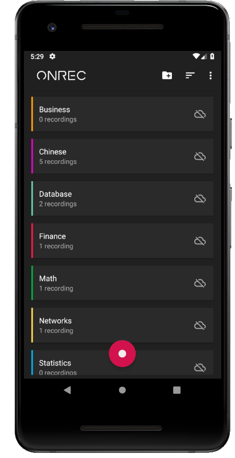
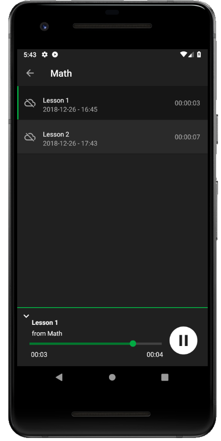

## Capstone-Project

##### onRec - a Simple recording app

onRec is a simple application for recording your personal notes, university lectures, business meetings and any voice memo you wish.

It features a polished and organized interface, allowing you to categorize your recordings into categories, 
and storing them in the cloud using Google Drive.

It's part of the Capstone project for the Udacity Nanodegree program.

 
    
    

